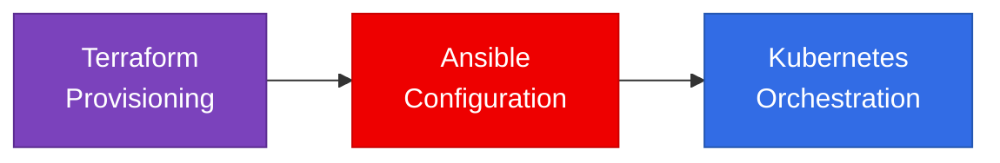

# TAK Pipeline - Hybrid Cloud Minecraft Infrastructure

**ハイブリッドクラウド構成によるMinecraftサーバー基盤**

[](LICENSE)


---

## 📋 プロジェクト概要

本プロジェクトは、**オンプレミス（自宅サーバー）とGoogle Cloud（GKE）を Tailscale VPN で接続**し、コスト効率と可用性を両立させたMinecraftサーバー基盤です。

Infrastructure as Code（IaC）を全面採用し、**Terraform / Ansible / Kubernetes マニフェスト**による完全な構成管理を実現しています。

## 【独自定義】TAKパイプライン

### 🎯 設計思想

| 観点 | アプローチ |
|------|-----------|
| **コスト最適化** | GKE Autopilot の Spot Pod（最大91%削減）+ オンプレ活用 |
| **可用性** | プロキシ層をクラウドに配置し、グローバルアクセスを確保 |
| **運用効率** | IaCによる宣言的管理、GitOps対応の設計 |
| **セキュリティ** | Tailscale によるゼロトラストネットワーク |

---

## 🏗️ アーキテクチャ

```mermaid
flowchart TB
    subgraph Internet["🌐 Internet"]
        Player["🎮 Player"]
    end

    subgraph GCP["☁️ Google Cloud (GKE Autopilot)"]
        subgraph GKE_NS["Namespace: minecraft"]
            LB["LoadBalancer<br/>:25565"]
            subgraph VelocityPod["Velocity Pod"]
                Velocity["Velocity Proxy<br/>:25577"]
                TS_Sidecar["Tailscale<br/>Sidecar"]
            end
            Lobby["Lobby Server<br/>(Paper / Spot Pod)<br/>1GB"]
        end
    end

    subgraph OnPrem["🏠 On-Premises (k3s on Proxmox)"]
        subgraph K3S_NS["Namespace: minecraft"]
            TS_Router["Tailscale<br/>Subnet Router"]
            subgraph GameServers["Game Servers"]
                Survival["Survival<br/>(Paper)<br/>4GB"]
                Industry["Industry<br/>(NeoForge)<br/>8GB"]
            end
        end
        HW["自作PC<br/>Ryzen5 5700G 8C16T | DDR4 64GB "]
    end

    Player -->|"TCP:25565"| LB
    LB --> Velocity
    Velocity --> Lobby
    Velocity <--> TS_Sidecar
    TS_Sidecar <-->|"Tailscale VPN<br/>(WireGuard)"| TS_Router
    TS_Router --> Survival
    TS_Router --> Industry
    GameServers -.-> HW

    style GCP fill:#012b4a,stroke:#1976d2
    style OnPrem fill:#4d0704,stroke:#f57c00
    style VelocityPod fill:#e8f5e9,stroke:#388e3c
    style GameServers fill:#fce4ec,stroke:#c2185b
```


### コンポーネント構成

| レイヤー | コンポーネント | 配置 | 役割 |
|----------|---------------|------|------|
| **Entry** | Velocity Proxy | GKE | プレイヤー接続の受付、サーバー振り分け |
| **Lobby** | Paper Server | GKE | 軽量ロビー（ステートレス、Spot Pod） |
| **Game** | Survival Server | On-Prem | バニラライクなサバイバル（4GB） |
| **Game** | Industry Server | On-Prem | NeoForge工業MOD（8GB） |
| **Network** | Tailscale | Both | ゼロトラストVPN接続 |

---

## 🛠️ 技術スタック

### Infrastructure as Code

| ツール | バージョン | 用途 |
|--------|-----------|------|
| **Terraform** | >= 1.5.0 | GKE / VPC / NAT / Proxmox VM のプロビジョニング |
| **Ansible** | - | k3s インストール、マニフェストデプロイ |
| **Kubernetes** | k3s + GKE | コンテナオーケストレーション |

### クラウド・インフラ

| サービス | 用途 |
|---------|------|
| **GKE Autopilot** | マネージドKubernetes（Spot Pod対応） |
| **Cloud NAT** | プライベートノードの外部通信 |
| **Proxmox VE** | オンプレミス仮想化基盤 |
| **Tailscale** | メッシュVPN（Subnet Router） |

### アプリケーション

| コンポーネント | イメージ |
|---------------|---------|
| Velocity Proxy | `itzg/bungeecord` |
| Paper Server | `itzg/minecraft-server` |
| NeoForge Server | `itzg/minecraft-server` |
| Metrics Exporter | `itzg/mc-monitor` |

---

## 📁 ディレクトリ構成

```
.
├── Ansible/
│   ├── ansible.cfg          # Ansible設定
│   ├── inventory.ini        # ホスト定義
│   ├── install_k3s.yml      # k3sインストールPlaybook
│   └── deploy_minecraft.yml # マニフェストデプロイPlaybook
│
├── Terraform/
│   ├── main.tf              # エントリポイント、プロバイダ設定
│   ├── gke.tf               # GKE Autopilot、VPC、NAT、Firewall
│   ├── proxmox.tf           # Proxmox VM定義（Cloud-Init対応）
│   ├── variables.tf         # 変数定義
│   ├── output.tf            # 出力定義
│   ├── provider.tf          # プロバイダ設定
│   ├── terraform.tfvars     # 変数値（サンプル）
│   └── secret.tfvars.template # シークレット用テンプレート
│
└── k8s/
    ├── gke/                  # GKE用マニフェスト
    │   ├── 00-namespace.yaml
    │   ├── 01-secrets.yaml.template
    │   ├── 02-velocity-config.yaml
    │   ├── 10-velocity-deployment.yaml
    │   ├── 11-lobby-deployment.yaml
    │   └── 20-services.yaml
    │
    └── onprem/               # オンプレミス(k3s)用マニフェスト
        ├── backend-servers.yaml  # Survival / Industry / Tailscale Router
        └── proxy.yaml            # スタンドアロン構成用Velocity
```

---

## ⚙️ 主要な設計ポイント

### 1. コスト最適化戦略

```hcl
# Terraform: Spot Pod強制設定
variable "enable_spot_only" {
  default = true  # 全ワークロードをSpot Podで実行
}
```

```yaml
# Kubernetes: Spot Pod toleration
nodeSelector:
  cloud.google.com/gke-spot: "true"
tolerations:
  - key: "cloud.google.com/gke-spot"
    operator: "Equal"
    value: "true"
    effect: "NoSchedule"
```

**効果**: GKE Autopilotの通常Podと比較して**最大91%のコスト削減**

### 2. ゼロトラストネットワーク

```yaml
# Tailscale Sidecar パターン
containers:
  - name: velocity
    # ... Minecraft Proxy
  - name: tailscale
    image: tailscale/tailscale:latest
    env:
      - name: TS_USERSPACE
        value: "true"  # GKE Autopilot対応
      - name: TS_EXTRA_ARGS
        value: "--accept-routes"
```

オンプレミス側の**Subnet Router**がk3s Service CIDR（`10.43.0.0/16`）をアドバタイズし、GKEからシームレスにアクセス可能。

### 3. Secret管理

```yaml
# initContainerによるSecret注入
initContainers:
  - name: inject-velocity-secret
    command: ["sh", "-c"]
    args:
      - |
        echo -n "${VELOCITY_SECRET}" > /velocity-data/forwarding.secret
    env:
      - name: VELOCITY_SECRET
        valueFrom:
          secretKeyRef:
            name: velocity-secret
            key: velocity-forwarding-secret
```

Kubernetes Secretから動的に設定ファイルを生成し、**ハードコーディングを排除**。

### 4. 可観測性

```yaml
# Prometheus メトリクス収集
containers:
  - name: mc-monitor
    image: itzg/mc-monitor:latest
    args: ["export-for-prometheus"]
annotations:
  prometheus.io/scrape: "true"
  prometheus.io/port: "8080"
```

**GKE Managed Prometheus**との連携により、追加のPrometheusサーバー不要で監視基盤を構築。

---

## 🚀 デプロイ手順

### 前提条件

- Terraform >= 1.5.0
- Ansible
- kubectl
- gcloud CLI（認証済み）
- Tailscale アカウント

### 1. GKEクラスター構築

```bash
cd Terraform

# 変数設定
cp secret.tfvars.template secret.tfvars
# secret.tfvars を編集（project_id, tailscale_auth_key等）

# プロビジョニング
terraform init
terraform plan -var-file="secret.tfvars"
terraform apply -var-file="secret.tfvars"
```

### 2. オンプレミスk3sセットアップ

```bash
cd Ansible

# k3sインストール
ansible-playbook -i inventory.ini install_k3s.yml

# マニフェストデプロイ
ansible-playbook -i inventory.ini deploy_minecraft.yml
```

### 3. GKEマニフェスト適用

```bash
# クレデンシャル取得
gcloud container clusters get-credentials tak-entrance --region asia-northeast1

# Secret作成（手動）
kubectl create secret generic velocity-secret \
  --from-literal=velocity-forwarding-secret='YOUR_SECRET' \
  -n minecraft

kubectl create secret generic tailscale-auth \
  --from-literal=TS_AUTHKEY='tskey-auth-xxxxx' \
  -n minecraft

# マニフェスト適用
kubectl apply -f k8s/gke/
```

---

## 📊 実証された成果

| 指標 | 結果 |
|------|------|
| **月間インフラコスト** | 約$15-20（Spot Pod + オンプレ併用） |
| **グローバル遅延** | 東京リージョン経由で国内100ms以下 |
| **デプロイ時間** | Terraform + Ansible で約15分 |
| **可用性** | Spot中断時も30秒以内に自動復旧 |

---

## 🔧 運用Tips

### Tailscale接続確認

```bash
# GKE側
kubectl exec -it deploy/velocity -c tailscale -- tailscale status

# オンプレ側
kubectl exec -it deploy/tailscale-subnet-router -- tailscale status
```

### ログ確認

```bash
# Velocity
kubectl logs -f deploy/velocity -c velocity

# Game Server
kubectl logs -f deploy/deploy-survival -c minecraft
```

---

## 📝 今後の拡張計画

- [ ] **Argo CD** によるGitOps化
- [ ] **External Secrets Operator** によるSecret管理の外部化
- [ ] **Grafana Dashboard** のテンプレート化
- [ ] **Disaster Recovery** 手順の文書化

---

## 📜 ライセンス

MIT License - 詳細は [LICENSE](LICENSE) を参照

---

## 👤 Author

**HN:田籠 (Tagomori)**

- GitHub: [@tagomori1102](https://github.com/tagomori1102)
- Portfolio: インフラエンジニア / SRE志望

---

> **Note**: 本プロジェクトは、クラウドとオンプレミスのハイブリッド構成における  
> Infrastructure as Code の実践的なポートフォリオとして構築されました。
